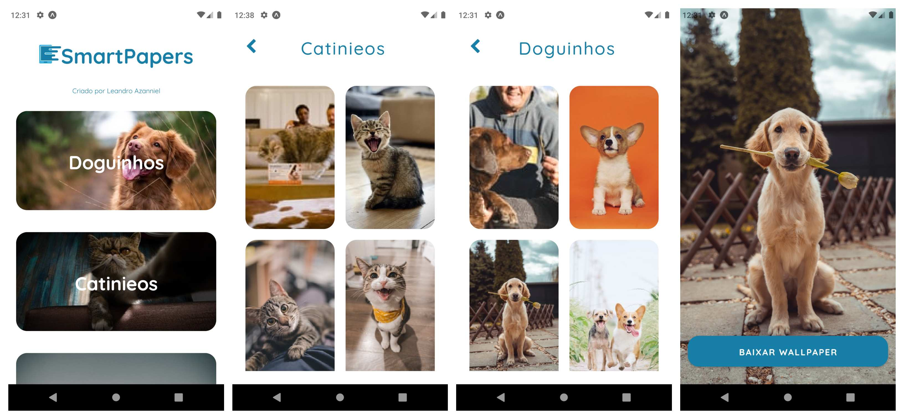

<div align="center">
  <h1> 
      
    SmartPaper
  </h1>

  📱 Uma aplicação para fins de estudos e que serve para você baixar Wallpapers para o seu Celular


  <a href="https://expo.io/@leandro_viana/projects/SmartPaper">
    
  </a>

  <a href="./LICENSE.md">
    
  </a>

  <a href="https://app.rocketseat.com.br/me/azanniel">
    
  </a>

</div>
<hr>
<br/>

## 🖼️ Prévia

A aplicação funciona utilizando a API do Unsplash sendo uma ferramenta para te ajudar a encontrar um Wallpaper bom para baixar e aplicar como Fundo de tela em seu Smartphone

<div align="center">
  
</div>

<br>

## 🏭 Tecnologias Utilizadas

O Projeto foi construído usando as seguintes tecnologias e ferramentas:
- **[Typescript](https://www.typescriptlang.org/)**
- **[React Native](https://reactnative.dev/)**
- **[Expo](https://expo.io/)**
- **[React Navigation](https://reactnavigation.org/)**
- **[Styled Components](https://styled-components.com/)**
- **[Eslint](https://eslint.org/)**


## 👷 Como codar no projeto ?

Caso você queira utilizar esse código e codar encima deste projeto e até mesmo contribuir segue alguns pré requisitos

### 👨‍💻 Pré requisitos

- Ter instalado o Expo
  - Para isso utilize `npm i -g expo-cli`
- Ter um emulador ou Aplicativo do Expo no SmartPhone
- Ter acesso à api do unplash

### 🔌 Ligando com a API do Unsplash

Você irá precisar ter uma conta no [Unsplash](https://unsplash.com/developers) para poder ligar o app à api e sair utilizando.

Para isso precisa pegar o **access key** e o **secret key** que o Unsplash lhe dá ao criar uma conta.

Ao pegar essas informações vá a pasta `mobile/src/services/unsplash` e copie o arquivo `config.example.ts` e renome-o para `config.ts` e adicione as informações de **access key** e **secret key**

### 🎳 Colocando pra rodar

Para iniciar então a aplicação com expo siga os passos após clonar o projeto

```bash
# Entre na pasta mobile
$ cd mobile

# Instale as dependências
$ npm install

# Execute com o expo
$ npm start

```

Após seguir esses passos irá aparecer um QRCode que você pode escanear utilizando o app do expo ou pode clicar na letra `a` para abrir no emulador do android caso tenha instalado

## 📖 Licença

Realizado em 2020

Esse projeto está licenciado pela MIT LICENSE. Para mais informações, leia o arquivo [LICENSE](./LICENSE.md).